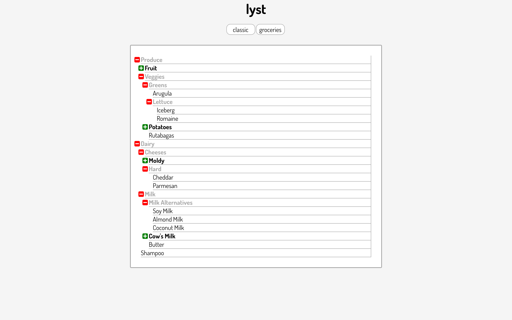

# Lyst

[Live Link][page]

<!-- [][page] -->
[page]: https://www.fdsimms.com/lyst

## Summary
Lyst shows one way to render infinitely nested lists using React. The App component takes in an array of JSON objects representing lists (here, the JSON is hard-coded as JavaScript, but it could be extended for use with actual API calls if needed). The component then renders those objects into List components. The List components then render their own contents recursively all the way down.

## Usage

The easiest way to check it out is by going to the live link [here][page]. Otherwise, download the files, move into the main directory and run `npm install` and `webpack` in the terminal. Then you're all set to load `index.html` into your browser.

From there, you can click on lists to expand them and again to close them. You can switch between "classic" and "groceries" views by clicking the appropriate button.

## Technologies Used
* React
* HTML5/CSS3
* Babel for transpiling JSX and ES6 syntax
* Webpack for bundling .js files

## Other

* Eslint for linting ES6
* [Font Awesome][fa-link] for plus and minus symbols
* [Google Fonts][gf-link] for free font
[fa-link]: https://fortawesome.github.io/Font-Awesome/
[gf-link]: https://google.com/fonts
