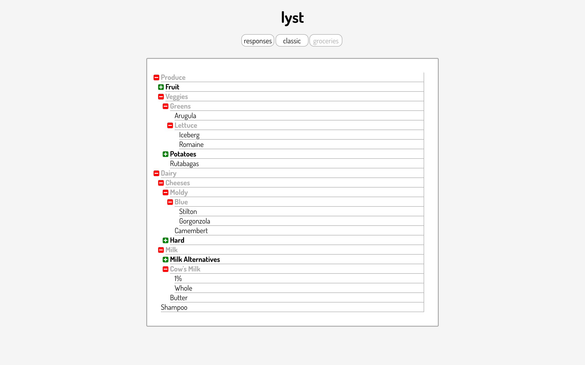

# Lyst

[Live Link][page]

<!-- [][page] -->
[page]: https://www.fsdimms.com/lyst

## Summary
Lyst shows one way to render infinitely nested lists using React. The App component takes in an array of JSON objects representing lists (here, the JSON is hard-coded as JavaScript, but it could be extended for use with actual API calls if needed). The component then renders those objects into List components. The List components then render their own contents recursively all the way down.

## Usage

The easiest way to check it out is by going to the live link [here][page]. Otherwise, download the files, move into the main directory and run `npm install` and `webpack` in the terminal. Then you're all set to load `index.html` into your browser.

From there, you can click on lists to expand them and again to close them. You can switch between "classic" and "groceries" views by clicking the appropriate button.

## Design Considerations

The simplicity of the prompt led me towards adopting a minimalist approach to designing my response. When I thought about lists, I immediately imagined a list written on a sheet of paper—a pretty minimalist way of keeping a list in real life. So I wanted to display the list on the page as though it were printed on lined loose-leaf. The borders on the list items, which only appear on the bottom and right sides, accomplish this without cluttering things up too much. The indentation on the left sides gives an easy visual reference to what level of the list we're on: it's just enough to set each level apart, but not so much that the list can't handle a pretty large number of levels before everything is squashed to one side. (Yes, it wouldn't be very pretty if it had to display an actual infinitely nested list, but in that case I would only show a certain number of levels at any given time.)

The rest of the design decisions all stemmed from a desire to let the user know what to do without beating them over the head with it. Some other visual cues: the green plus symbols and red minus symbols paired with bold font and on-hover color changes shows the user which items can be clicked on to expand them further. When a list has already been expanded, its font turns gray to reflect its status. Buttons you can't click on are faded, and buttons you can click on get darker when you hover over them.

One benefit of the minimalist approach is that the site is pretty responsive. When the width of the main div is too small, some of the list text can spill out if a word is too long, but other than that it pulls off being rather responsive without really trying (kind of like how Oreos are accidentally vegan).

## Technologies Used
* React
* HTML5/CSS3
* Babel for transpiling JSX and ES6 syntax
* Webpack for bundling .js files

## Other

* Eslint for linting ES6
* [Font Awesome][fa-link] for plus and minus symbols
* [Google Fonts][gf-link] for free font
[fa-link]: https://fortawesome.github.io/Font-Awesome/
[gf-link]: https://google.com/fonts
